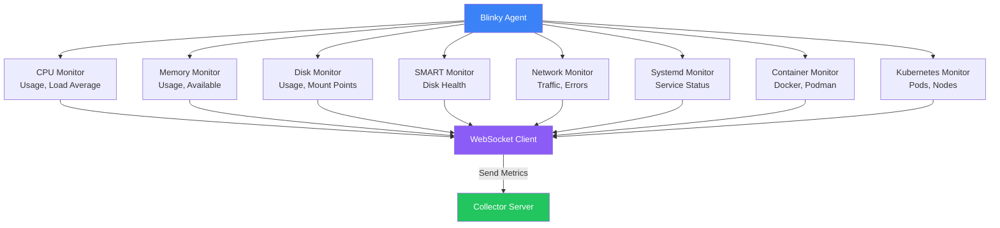
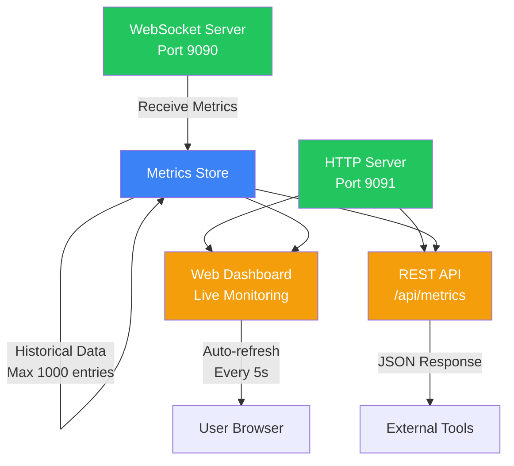
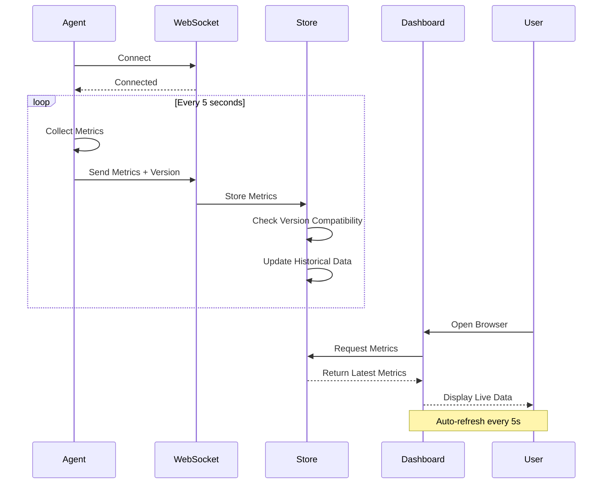
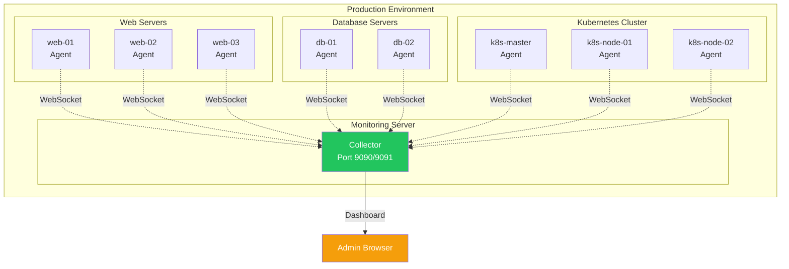

# Blinky

Blinky is a lightweight, real-time monitoring system for Linux hosts, specifically designed for Debian-based systems. It provides comprehensive system monitoring with minimal dependencies and overhead.

## Quick Install

### AMD64 (x86_64) - Pre-built Binary

Install the agent on any Debian/Ubuntu AMD64 host with a single command:

```bash
curl -fsSL https://raw.githubusercontent.com/nerdpitchcloud/blinky/main/install-agent.sh | sudo bash
```

Or download a specific version:
```bash
curl -fsSL https://raw.githubusercontent.com/nerdpitchcloud/blinky/main/install-agent.sh | sudo bash -s v0.1.0
```

### ARM64 (aarch64) - Build from Source

For ARM64 systems (Raspberry Pi, AWS Graviton, etc.):

```bash
curl -fsSL https://raw.githubusercontent.com/nerdpitchcloud/blinky/main/install-from-source.sh | sudo bash
```

### Configure and Start

```bash
blinky-agent -s <collector-host> -p 9090 -i 5
```

## Architecture

### System Overview


### Agent Architecture



### Collector Architecture



### Data Flow



### Deployment Topology



## Releases

Blinky follows [Semantic Versioning](https://semver.org/) (SemVer):
- **Major version** (X.0.0): Breaking changes
- **Minor version** (0.X.0): New features, backward compatible
- **Patch version** (0.0.X): Bug fixes, backward compatible

### Available Downloads

Pre-built binaries are available for:
- **Linux AMD64** (x86_64)
- **Linux ARM64** (aarch64)

Download the latest release from [GitHub Releases](https://github.com/nerdpitchcloud/blinky/releases).

### Version Tracking

The collector automatically tracks agent versions and displays warnings when version mismatches are detected. This helps ensure compatibility across your infrastructure.

## Building

### Prerequisites
```bash
apt-get update
apt-get install -y build-essential cmake libssl-dev
```

### Build Instructions
```bash
git clone https://github.com/nerdpitchcloud/blinky.git
cd blinky
mkdir build && cd build
cmake ..
make -j$(nproc)
```

This will create two binaries:
- `agent/blinky-agent` - The monitoring agent
- `collector/blinky-collector` - The collector server

## Usage

### Running the Collector

Start the collector server on your monitoring host:

```bash
./collector/blinky-collector
```

Options:
- `-w, --ws-port PORT` - WebSocket port (default: 9090)
- `-p, --http-port PORT` - HTTP dashboard port (default: 9091)

The dashboard will be available at `http://localhost:9091/`

### Running the Agent

On each host you want to monitor:

```bash
./agent/blinky-agent -s <collector-host> -p 9090
```

Options:
- `-s, --server HOST` - Collector server hostname/IP (default: localhost)
- `-p, --port PORT` - Collector WebSocket port (default: 9090)
- `-i, --interval SECONDS` - Metrics collection interval (default: 5)

### Example Setup

1. Start collector on monitoring server:
```bash
./collector/blinky-collector -w 9090 -p 9091
```

2. Start agents on monitored hosts:
```bash
# On host1
./agent/blinky-agent -s monitoring.example.com -p 9090 -i 5

# On host2
./agent/blinky-agent -s monitoring.example.com -p 9090 -i 5
```

3. Open dashboard in browser:
```
http://monitoring.example.com:9091/
```

### Monitoring Tools

#### Live Terminal Monitor (btop-style)

Monitor all hosts in real-time with a live updating terminal interface:

```bash
./blinky-monitor.py http://localhost:9091/api/metrics
```

Features:
- Auto-refreshing every 5 seconds
- Color-coded status indicators
- Progress bars for CPU, memory, and disk usage
- Shows all metrics: CPU, memory, disks, SMART health, network, containers, Kubernetes
- Version mismatch warnings
- Clean terminal UI

#### Quick Status Check

Get a quick snapshot of all hosts:

```bash
./blinky-check.sh http://localhost:9091/api/metrics
```

This provides a one-time status check without live updates, useful for scripts and automation.

## API Endpoints

### REST API

- `GET /` - Dashboard homepage
- `GET /api/metrics` - JSON metrics for all hosts

Example API response:
```json
{
  "hosts": [
    {
      "hostname": "web-server-01",
      "online": true,
      "metrics": {
        "timestamp": 1702742400,
        "cpu": {"usage": 45.2, "load_1": 1.5},
        "memory": {"usage": 62.3, "total": 8589934592},
        "disks": [...],
        "containers": [...]
      }
    }
  ]
}
```

## Monitored Metrics

### System Metrics
- CPU usage percentage
- Load averages (1, 5, 15 minutes)
- Memory usage and availability
- Disk usage per mount point
- System uptime

### SMART Data
- Disk temperature
- Power-on hours
- Reallocated sectors
- Pending sectors
- Health status (PASSED/FAILED)

### Network
- Bytes/packets received and transmitted
- Error counts per interface

### Systemd Services
- Service state (active/inactive)
- Sub-state
- Enabled status

### Containers
- Docker and Podman support
- Container state
- CPU and memory usage
- Runtime information

### Kubernetes
- Cluster type detection (k8s/k3s)
- Pod count
- Node count
- Namespace list

## Dependencies

### Runtime Dependencies
- Linux kernel with /proc filesystem
- systemd (for service monitoring)
- smartctl (for SMART disk monitoring, optional)
- docker/podman (for container monitoring, optional)
- kubectl/k3s (for Kubernetes monitoring, optional)

### Build Dependencies
- C++17 compiler (GCC 7+ or Clang 5+)
- CMake 3.14+
- OpenSSL development libraries

## Project Structure

```
blinky/
├── agent/              # Monitoring agent
│   ├── include/        # Agent headers
│   └── src/            # Agent implementation
├── collector/          # Collector server
│   ├── include/        # Collector headers
│   └── src/            # Collector implementation
├── shared/             # Shared protocol library
│   ├── include/        # Shared headers
│   └── src/            # Shared implementation
└── build/              # Build output
```

## License

MIT License - See LICENSE file for details 
