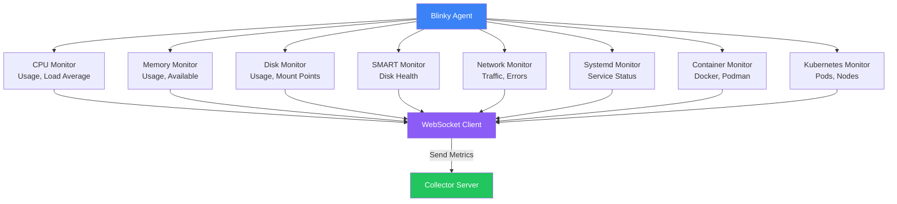
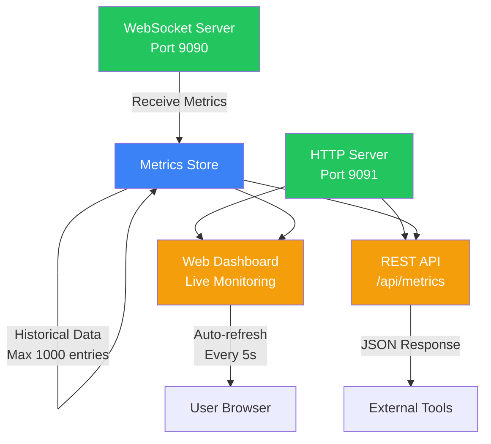
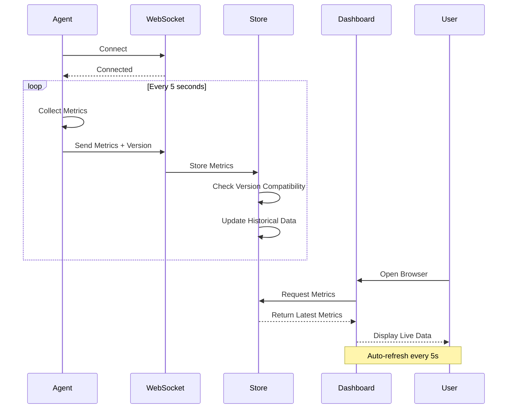
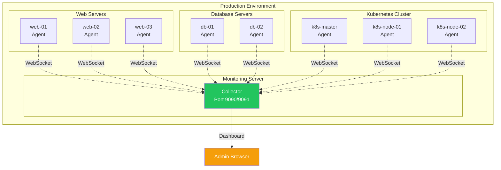

# Blinky

Blinky is a lightweight, real-time monitoring system for Linux hosts, specifically designed for Debian-based systems. It provides comprehensive system monitoring with minimal dependencies and overhead.

## Installation

```bash
# Quick install (any Linux)
curl -fsSL https://raw.githubusercontent.com/nerdpitchcloud/blinky/main/install.sh | sudo bash

# Debian/Ubuntu (DEB package)
wget https://github.com/nerdpitchcloud/blinky/releases/latest/download/blinky-agent_0.1.14_amd64.deb
sudo dpkg -i blinky-agent_0.1.14_amd64.deb

# Upgrade
sudo blinky-agent upgrade

# Uninstall
curl -fsSL https://raw.githubusercontent.com/nerdpitchcloud/blinky/main/uninstall.sh | sudo bash
```

## Operating Modes

Blinky supports multiple operating modes:

- **local**: Store metrics locally only (no network required)
- **pull**: Local storage + HTTP API for pulling metrics (default)
- **push**: Push metrics to collector via WebSocket
- **hybrid**: Both push to collector AND store locally with API

### Pull Mode (Default)

The agent stores metrics locally and exposes an HTTP API:

```bash
# Start agent (uses pull mode by default)
blinky-agent

# Access latest metrics
curl http://localhost:9092/metrics

# Get last 100 metrics
curl http://localhost:9092/metrics/latest?count=100

# Health check
curl http://localhost:9092/health
```

Metrics are stored in `/var/lib/blinky/metrics` with automatic rotation.

### Push Mode

Configure the agent to push metrics to a collector:

```toml
[agent]
mode = "push"

[collector]
enabled = true
host = "collector.example.com"
port = 9090
```

### Hybrid Mode

Get the best of both worlds - push to collector AND maintain local storage:

```toml
[agent]
mode = "hybrid"

[collector]
enabled = true
host = "collector.example.com"
```

## Configuration

Edit `/etc/blinky/config.toml` to configure the agent:

```toml
[agent]
mode = "pull"  # local, pull, push, or hybrid
interval = 5

[storage]
path = "/var/lib/blinky/metrics"
max_files = 100
max_file_size_mb = 10

[api]
enabled = true
port = 9092

[collector]
enabled = false
host = "localhost"
port = 9090
```

For complete configuration options, see:
- [CONFIGURATION.md](CONFIGURATION.md) - Complete configuration guide
- [config.toml.example](config.toml.example) - Example with all options

### Collector (Docker)

The collector runs in a Docker container. See the deployment section below for Docker Compose configuration.

## Architecture

### System Overview


### Agent Architecture



### Collector Architecture



### Data Flow



### Deployment Topology



## Upgrading

Upgrade to the latest version with a single command:

```bash
sudo blinky-agent upgrade
```

The upgrade command will:
- Check GitHub for the latest release
- Download and verify the new version
- Install the update automatically
- Preserve your configuration

If running as a service, restart it after upgrade:
```bash
sudo systemctl restart blinky-agent
```

## Uninstalling

Remove Blinky from your system:

```bash
curl -fsSL https://raw.githubusercontent.com/nerdpitchcloud/blinky/main/uninstall.sh | sudo bash
```

The uninstall script will:
- Stop and disable the service (if running)
- Remove the binary
- Optionally remove configuration and stored metrics

## Building

### Prerequisites
```bash
apt-get update
apt-get install -y build-essential cmake libssl-dev
```

### Build Instructions
```bash
git clone https://github.com/nerdpitchcloud/blinky.git
cd blinky
mkdir build && cd build
cmake ..
make -j$(nproc)
```

This will create two binaries:
- `agent/blinky-agent` - The monitoring agent
- `collector/blinky-collector` - The collector server

## Usage

### Running the Collector

Start the collector server on your monitoring host:

```bash
./collector/blinky-collector
```

Options:
- `-w, --ws-port PORT` - WebSocket port (default: 9090)
- `-p, --http-port PORT` - HTTP dashboard port (default: 9091)

The dashboard will be available at `http://localhost:9091/`

### Running the Agent

On each host you want to monitor:

```bash
./agent/blinky-agent -s <collector-host> -p 9090
```

Options:
- `-s, --server HOST` - Collector server hostname/IP (default: localhost)
- `-p, --port PORT` - Collector WebSocket port (default: 9090)
- `-i, --interval SECONDS` - Metrics collection interval (default: 5)

### Example Setup

1. Start collector on monitoring server:
```bash
./collector/blinky-collector -w 9090 -p 9091
```

2. Start agents on monitored hosts:
```bash
# On host1
./agent/blinky-agent -s monitoring.example.com -p 9090 -i 5

# On host2
./agent/blinky-agent -s monitoring.example.com -p 9090 -i 5
```

3. Open dashboard in browser:
```
http://monitoring.example.com:9091/
```

### Monitoring

View live metrics with the included Python script:

```bash
# Quick snapshot
./blinky-me.py

# Live updates
./blinky-me.py --watch

# Show all details
./blinky-me.py --all --watch

# Remote agent
./blinky-me.py --url http://host:9092/metrics

# Collector
./blinky-me.py --collector http://host:9091/api/metrics --watch
```

## API Endpoints

### REST API

- `GET /` - Dashboard homepage
- `GET /api/metrics` - JSON metrics for all hosts

Example API response:
```json
{
  "hosts": [
    {
      "hostname": "web-server-01",
      "online": true,
      "metrics": {
        "timestamp": 1702742400,
        "cpu": {"usage": 45.2, "load_1": 1.5},
        "memory": {"usage": 62.3, "total": 8589934592},
        "disks": [...],
        "containers": [...]
      }
    }
  ]
}
```

## License

MIT License - See LICENSE file for details 
